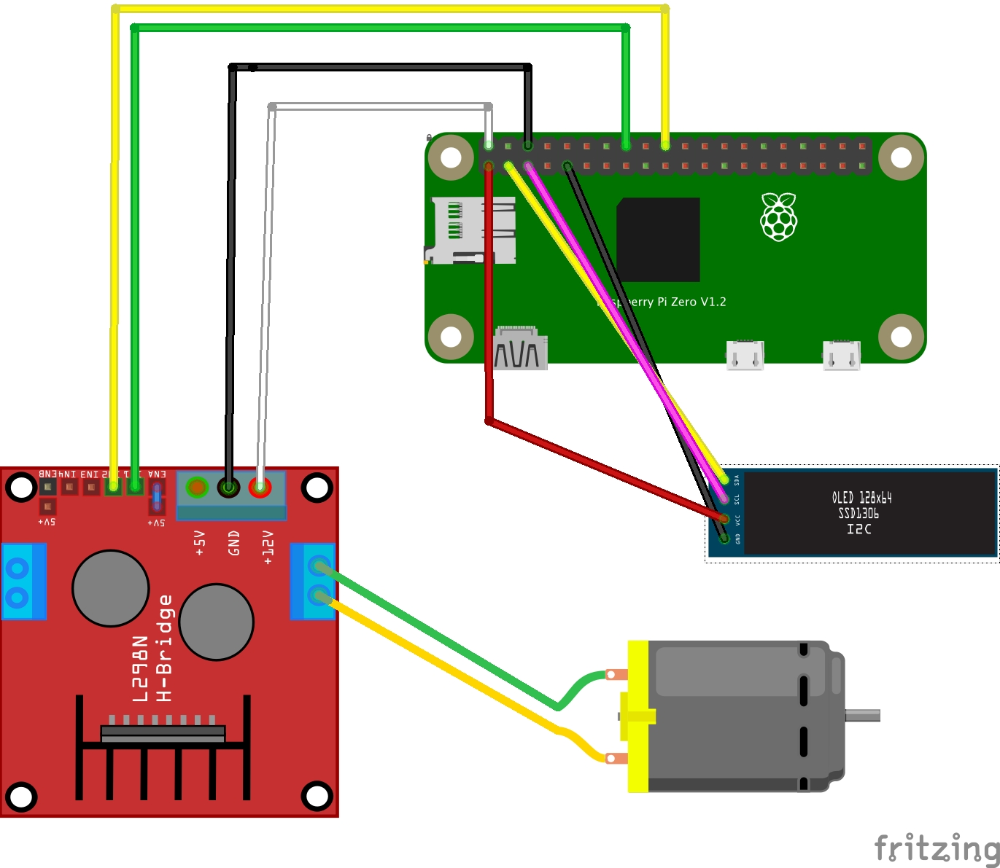
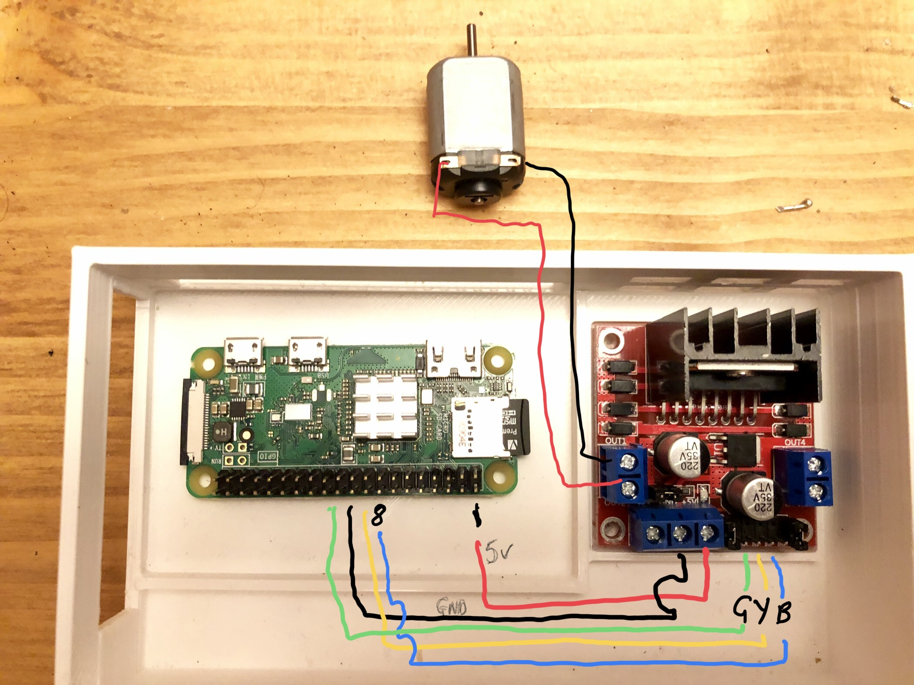
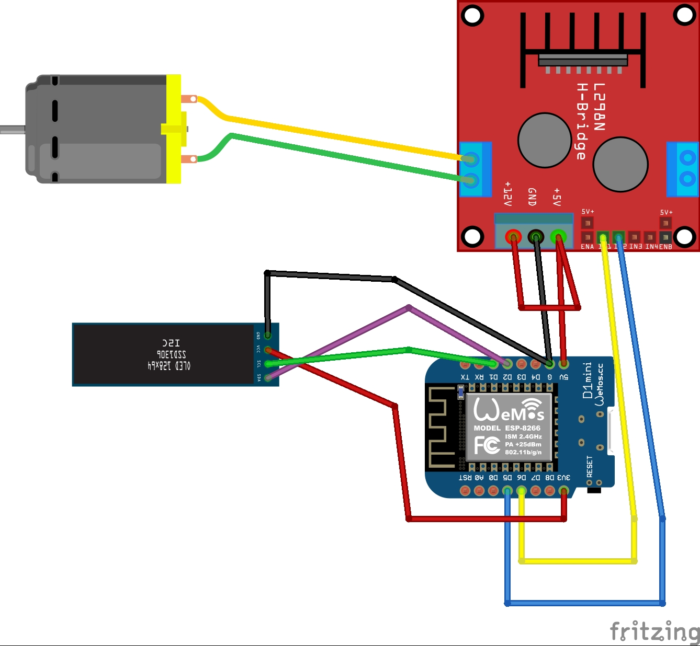
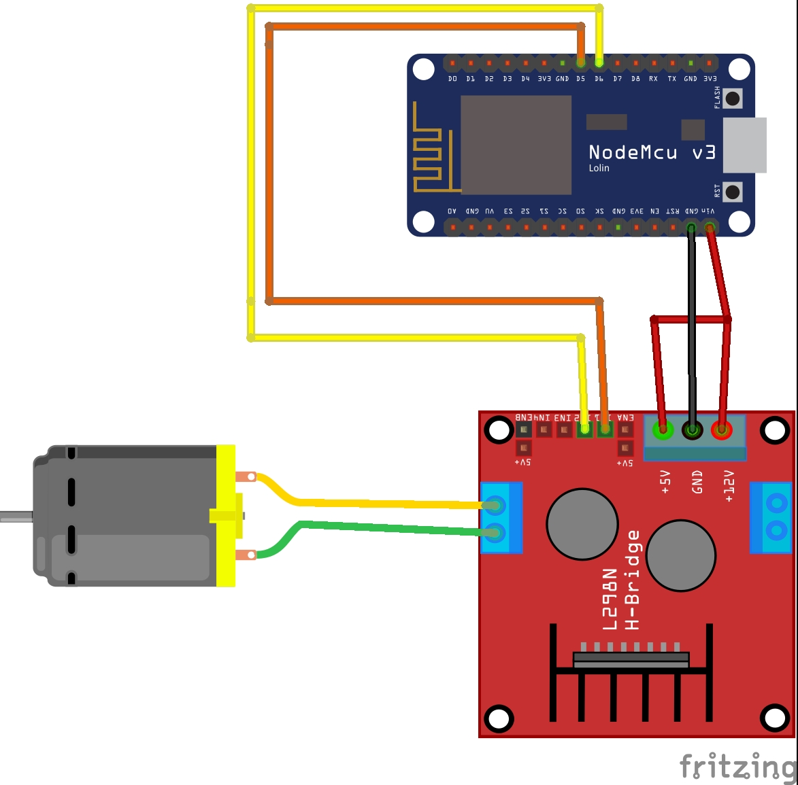

# Turbine3D

3D turbine model with controllable blade speed

Parts
* Raspberry pi zero (minimum spec) or Arduino D1 Mini (Nodemcu)
* 6v dc model  motor
* L298N stepper controller
* Oled i2c lcd display (optional)

  
Raspberry Pi

  

  
Arduino D1 Mini

  
  

  

  
Arduino nodeMCU

  

# Turbine3D

remixed based on an original model by [mespace2](https://www.thingiverse.com/me2space/about) 

  https://www.thingiverse.com/thing:1767153
